# docker-study

## 가상화 기술
서버는 웹서버(정적), WAS(동적 어플리케이션) 등으로 구분됨

### 왜 가상화?
한 OS에서 여러 소프트웨어를 실행하면 소프트웨어 간의 간섭이 발생한다.
1. 하나의 프로그램에 문제가 생기면 다른 프로그램에도 문제 가능성
2. 하나의 프로그램 트래픽이 급증해서 리소스를 모두 소모하면 나머지 프로그램 문제

- 사용자가 원하는 만큼 리소스 분배할 수 있다.
- 논리적으로 격리되어 있어 앞서 말한 문제들을 예방할 수 있다.

하드웨어 성능은 증가하고 소프트웨어 요구사항은 감소하는 추세.
높은 성능 서버 한 대를 운용하는 것이 효율적이다.

## 가상화 방식
### 1. Hypervisor(Virtual Machine)

<p align="center">
  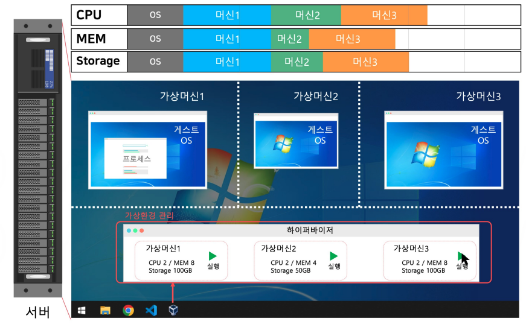
</p>
Host OS의 자원을 격리해서 새로운 OS(Guest)를 실행한다.
- 이미지를 스토리지에 저장하고 있다가, 실행하면 메모리와 CPU를 사용한다.

<p align="center">
  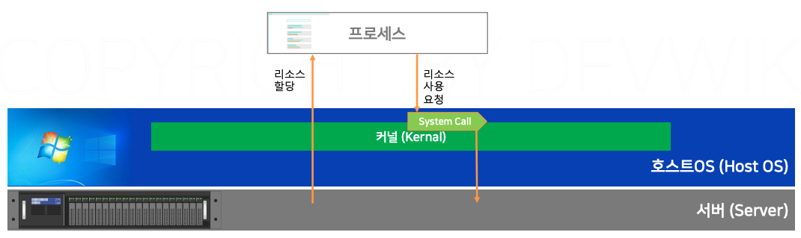
</p>

프로세스는 시스템콜로 OS의 커널을 통해서만 리소스를 사용할 수 있다.

<p align="center">
  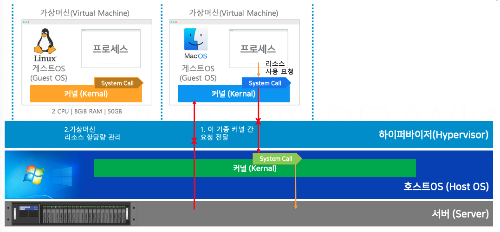
</p>

hypervisor 소프트웨어가 시스템 콜을 통역해주는 역할

### 2. Container

> 가볍고 빠르다.

<p align="center">
  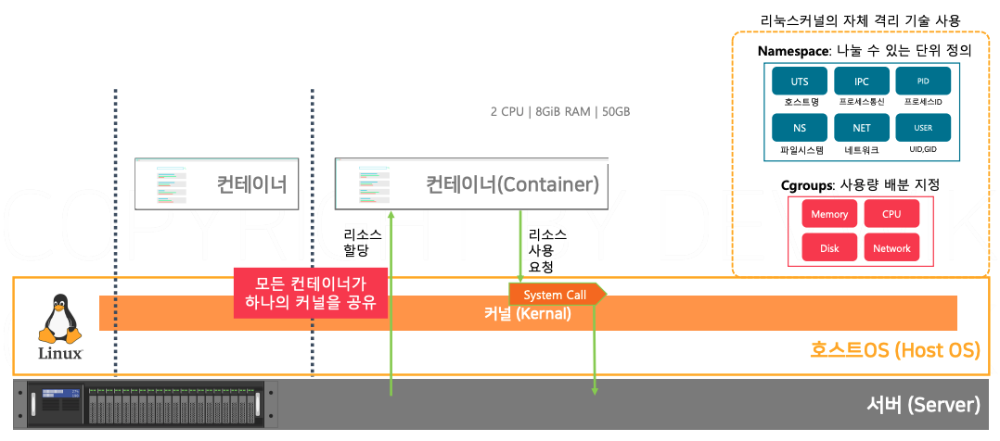
</p>

`LXC(Linux Containers)`를 사용하면 **Kernel 자체 기능**으로 격리 공간을 만들 수 있다.
- 커널의 `name space`와 `CGroups(control groups)`를 활용한다.
- name space : 프로세스, 하드드라이브, 네트워크, 사용자 등 리소스를 나누는 기준
- CGroups : 프로세스가 사용하는 메모리, CPU 등 리소스를 배분

> Host OS Kernel을 공유한다.

오버헤드가 작다 -> HW 리소스 사용 요청이 효율적이다.

LXC는 사용자가 직접 컨트롤하기 어렵다.
`Docker`는 이러한 컨테이너 격리 기술을 활용할 수 있게 도와준다.

---

## Docker

`Container Platform` : Docker와 같은 컨테이너 가상화 도구 

<p align="center">
  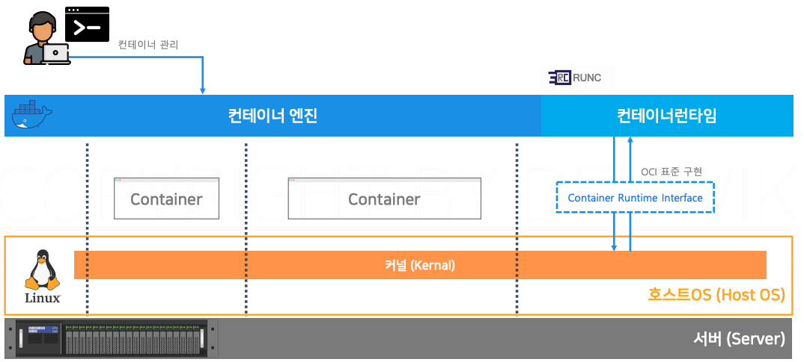
</p>

- `컨테이너 엔진`과 `컨테이너 런타임`으로 구성됨
  - 컨테이너 엔진 : 사용자 요청 받아 컨테이너 관리
  - 컨테이너 런타임 : 직접 커널과 통신하며 **실제 격리 공간 생성**
    - Docker는 `RUNC`라는 컨테이너 런타임을 사용하며, OCI 표준에 맞는 다른 런타임도 가능

### Architecture

<p align="center">
  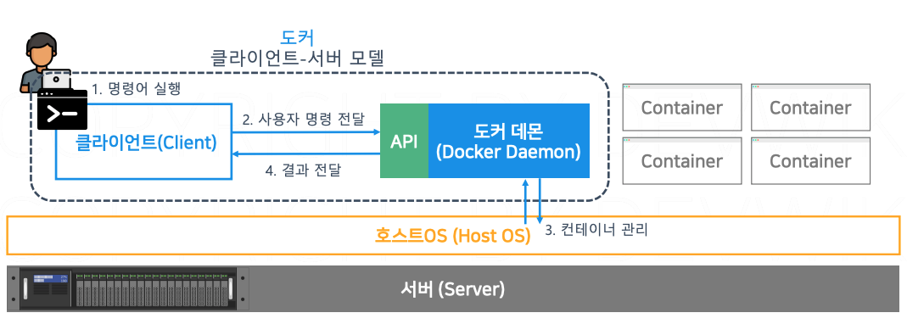
</p>

도커는 client-server 모델로 실행된다.
Docker Daemon이 서버처럼 동작한다.
- Daemon : 서버에서 지속적으로 실행되는 소프트웨어
- API : 데이터를 주고 받는 규약

### Basic Commands

```bash
docker version
docker info

docker --help
docker ([management-commend]) [command]
```

```bash
# 컨테이너 실행
docker run {image-name}

# 컨테이너 삭제
docker rm {container-name / id} 
```

```bash
docker run -p 80:80 --name nginx-test nginx
```

---

## Image

Image : 파일 시스템의 특정 시점을 저장해 놓은 압축 파일

- 프로그램 : Disk에 저장된 실행 가능한 SW
- 프로세스 : 프로그램이 매모라에 올라가 실행 상태임

- 이미지 : Disk에 저장된 실행 가능한 SW
- 컨테이너 : 이미지가 메모리에 올라가 실행 상태임
  - 이미지 1개로 여러 컨테이너 실행 가능
  - 컨테이너 실행 시 프로세스도 함께 실행

### Image Command

```bash
# 백그라운드(-d)에서 컨테이너 실행
docker run -d --name {container-name} {image-name}

# 실행 중인 컨테이너 리스트 조회
docker ps 

# 실행 중인 컨테이너 삭제
docker rm -f {container-name}
```

### Image-metadata
Image : 실제 압축되어 있는 데이터
Metadata : 이미지에 대한 정보(데이터에 대한 데이터)

<p align="center">
  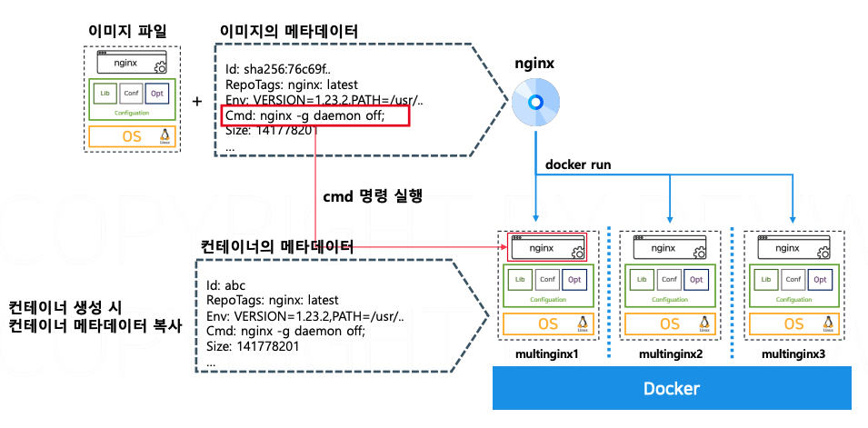
</p>

- env : 환결 설정 정보, key-value 구조
- cmd : 이미지를 컨테이너로 실행할 때 명령어

### Metadata Command

```bash
# 이미지 세부 정보 조회
docker image inspect {image-name}

# 컨테이너 세부 정보 조회
docker container inspect {container-name}

# 컨테이너 실행 시 메타데이터의 cmd 덮어쓰기
docker run {image-name} (command)

# 컨테이너 실행 시 메타데이터의 env 덮어쓰기
docker run --env KEY=VALUE {iamge-name}

# 이미지 다운로드
docker pull {image-name}
```

1회성 로그는 `-d` 옵션 없이 사용

### Container Life-cycle


<p align="center">
  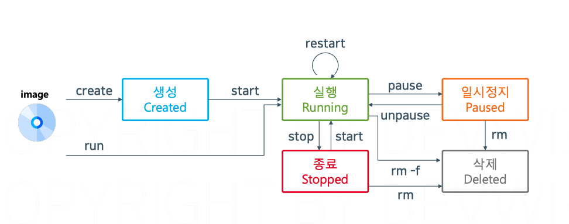
</p>

- create : image를 container로 만든다. (아직 리소스 사용 X)
- start : 컨테이너 metadata의 cmd 값으로 컨테이가 running 상태가 됨.
- run : create + start
- pause : 현재 상태를 메모리에 저장(CPU는 사용하지 않고 매모리만 사용)
- stop : 컨테이너의 프로세스 중단(메모리와 CPU 사용 모두 중단)
- rm : 컨테이너 삭제

```bash
# 컨테이너 실행 및 출력 연결
docker start -i {container-name}

# 컨테이너 로그 조회
docker logs {container-name}

# 실시간 로그 조회
docker logs -f {container-name}
```

--- 

## Image Registry
> 도커 이미지를 저장하여 공유하거나 다운 받는다
`Docker Hub`가 대표적인 이미지 레지스트리

- 이미지 공유/다운로드
- 이미지 검색
- 이미지 버전 관리
- 보안 및 권한 관리
- 파이프라인(자동 배포, 알림 등)

### Registry Flow

<p align="center">
  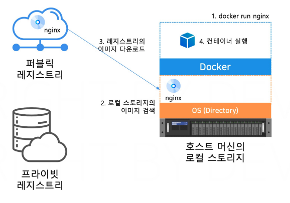
</p>

로컬에 없으면 다운 받고, 이미 다운 받아서 로컬에 있다면 로컬에서 이미지 실행

- 도커허브 : 퍼블릭 레지스트리
- 사내 : 프라이빗 레지스트리
  - 직접 서버에 레지스트리 설치(HARBOR, Docker Private Registry)
  - public 클라우드(AWS ECR, Azure Container Registry)

### Image Naming Rule

<p align="center">
  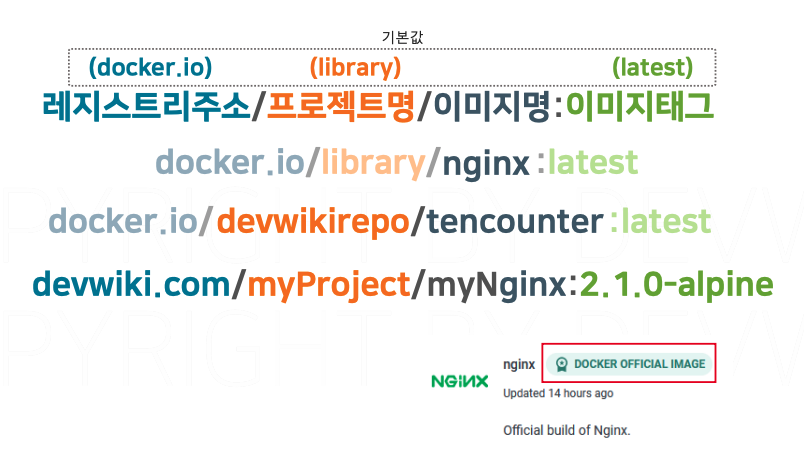
</p>

> 레지스트리주소/프로젝트명/이미지명:이미지태그

### Registry Command

```bash
# 로컬 스토리지로 이미지 다운로드
docker pull {image-name}

# 로컬 스토리지의 이미지명 추가
docker tag {exisiting-image-name} {adding-image-name}

# 레지스트리에 이미지 업로드
docker push {image-name}

# 로컬 스토리지 이미지 삭제
docker image rm {image-name}


docker login
docker logout
```

## Image Build

### Layer File System

<p align="center">
  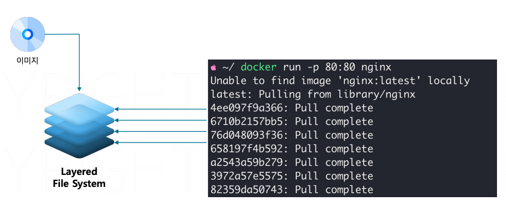
</p>

- 각각의 레이어는 이미지의 일부분이다.
- 레이어 구조는 재사용에 유리하다.
- 이미지 전송, 저장에 스토리지, 네트워크 사용량을 줄일 수 있다.

<p align="center">
  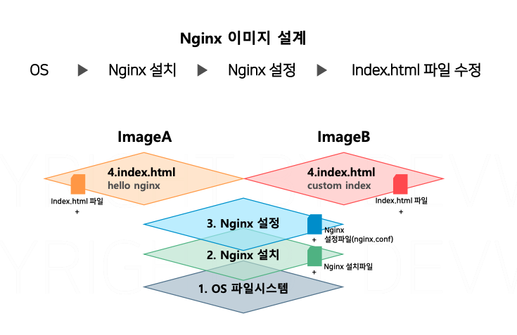
  </br>
  </br>
  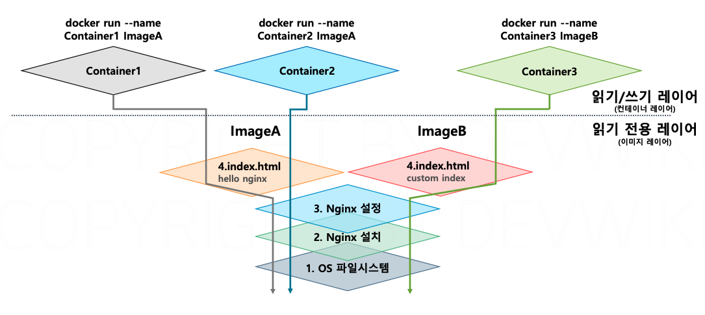
</p>

- Nignx 설정, 설치, 파일 시스템이 동일할 경우 공유 가능
- 이전(하위) 레이어의 변경사항만 추가로 관리하면 됨.
- 컨테이너 레이어는 읽기, 쓰기 모두 가능함

### Iamge Layer Command

```bash
# 이미지의 레이어 이력 조회
docker image history {image-name}
```

<p align="center">
  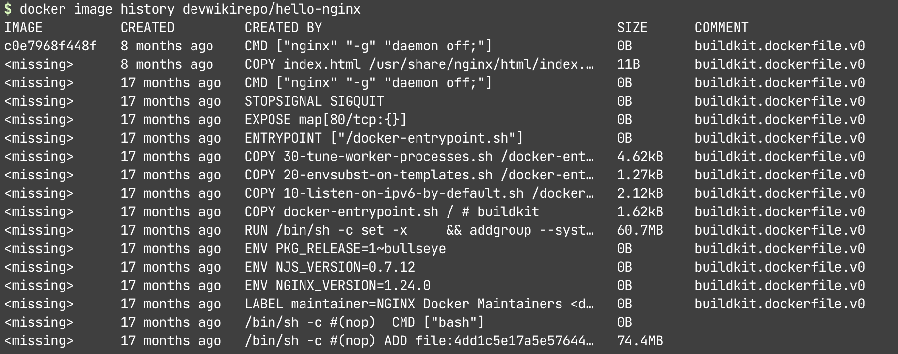
</p>

- `COPY` : 이미지 파일을 기존 레이어에 붙여넣기

<p align="center">
  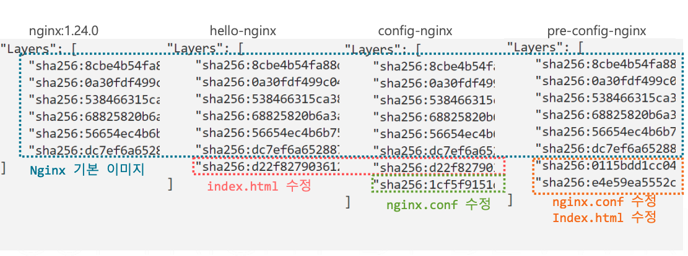
  </br>
  </br>
  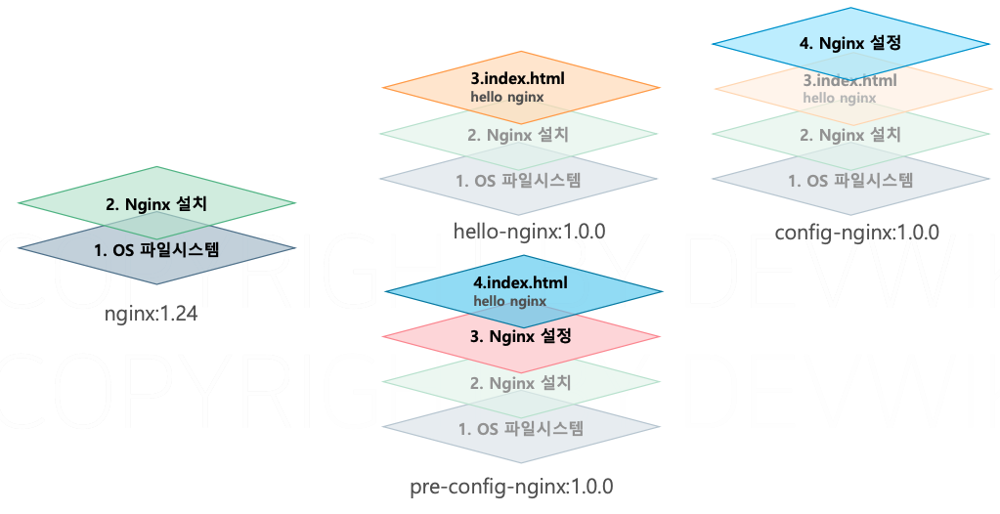
</p>

- **CoW(Copy-on-Write)** : 다음 레이어에서 이전 레이어의 특정 파일을 수정할 때, 복사본을 만들어서 변경사항 적용. 원래 레이어는 수정되지 않고 원본 유지됨
- **Immutable Layer** : 각 이미지 레이어는 불변, 한 번 생성되면 변경 X. 일관성 유지 및 안전하게 공유
- **Caching** : 이미 빌드된 레이어 재사용 가능

## Image Build 

### Image Commit

<p align="center">
  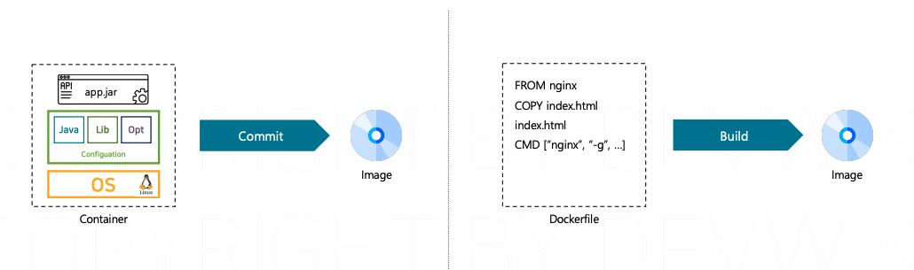
</p>

이미지를 만드는 2가지 방법

1. Commit : 실행 중인 컨테이너를 그 상태 그대로 이미지로 만듬
2. Build(Preferred) :  Docker File 명세를 통해서 만듬. Commit 기반

<p align="center">
  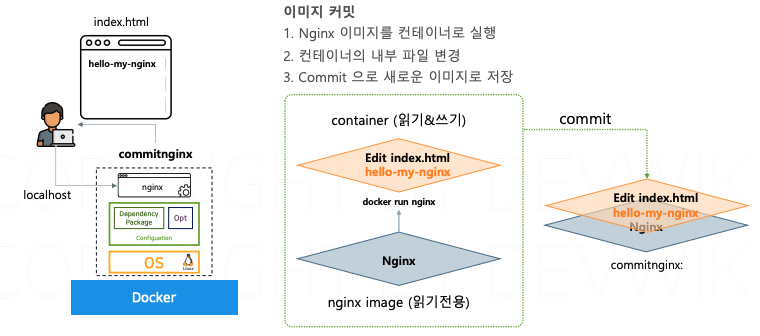
</p>

- 지금까지는 이미지에서 컨테이너로 실행
- 이번엔 반대로 커밋으로 컨테이너 상태를 이미지로 생성

### Procedure
- `docker run` 명령어로 nignx 이미지를 실행하면 nginx 이미지 위에 컨테이너 레이어 생성
- nginx 이미지에 있던 파일을 카피해서 컨테이너 레이어에서 수정, 수정된 파일을 write
- `Commit` 기능으로 수정된 컨테이너 레이어를 포함한 모든 레이어의 상태를 이미지로 저장


### Commit Command
```bash
# 컨테이너 실행과 동시에 터미널 접속
docker run -it --name {container-name} {image-name} bin/bash

# 실행 중인 컨테이너를 이미지로 생성
docker commit -m {commit-name} {running-container-name} {create-image-name}
```
